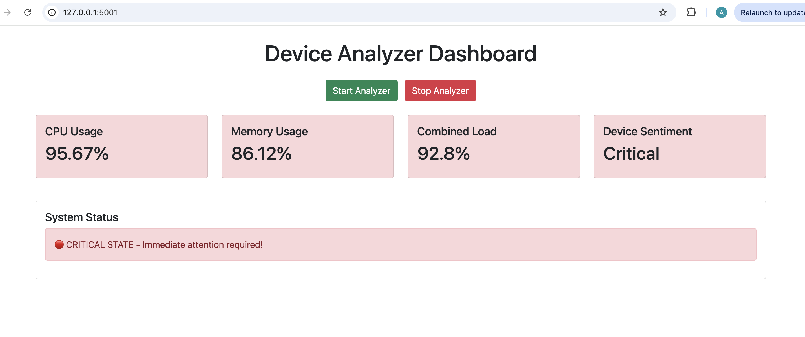
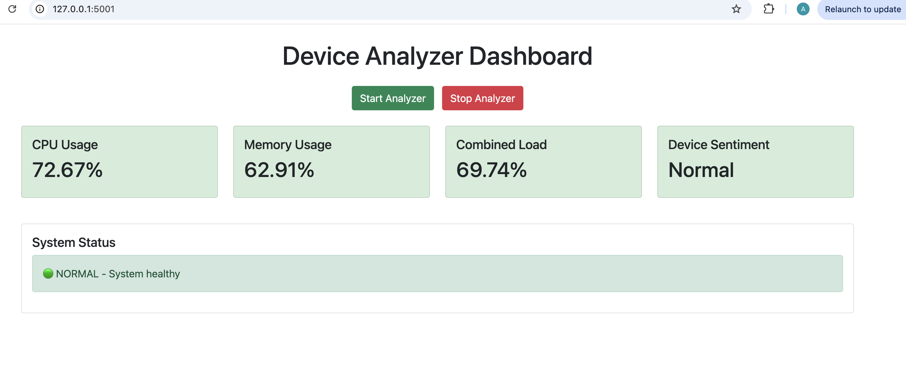

# Smart Device Analyzer

An advanced AI-powered system for analyzing device and sensor data, providing intelligent insights through sentiment analysis and anomaly detection.

## Overview

This project leverages artificial intelligence to:
- Analyze device/sensor data in real-time
- Detect anomalies and potential issues
- Provide sentiment analysis on data patterns
- Generate actionable insights
- Monitor device performance

## Live Demo
- Frontend: [https://device-analyzer.vercel.app](https://device-analyzer.vercel.app)
- Backend: 

## Project Structure
```
/
├── app.py                # Main Flask application
├── ai_analyzer.py        # AI analysis logic
├── templates/           
│   └── index.html       # Frontend dashboard
├── src/
│   ├── __init__.py
│   ├── config.py        # Configuration settings
│   ├── data_pipeline.py # Data processing pipeline
│   └── data_handlers/
│       └── sample_data.py
├── requirements.txt     # Python dependencies
└── vercel.json         # Vercel configuration
```

## Technical Requirements

- Python 3.11+
- Flask
- WebSocket support
- Additional dependencies in requirements.txt

## Local Development Setup

1. **Clone the repository:**
```bash
git clone https://github.com/yourusername/smart-device-analyzer.git
cd smart-device-analyzer
```

2. **Create and activate virtual environment:**
```bash
python -m venv venv
source venv/bin/activate  # On Windows: venv\Scripts\activate
```

3. **Install dependencies:**
```bash
pip install -r requirements.txt
```

4. **Run the application:**
```bash
python app.py
```

The application will start with:
- Backend server: `http://127.0.0.1:5001`
- WebSocket server: `http://127.0.0.1:5002`
- Access dashboard: Open `http://127.0.0.1:5001` in your browser

## Debugging Common Issues

1. **Port Already in Use:**
   ```bash
   # Check ports (macOS/Linux)
   lsof -i :5001
   lsof -i :5002
   
   # Kill process
   kill -9 <PID>
   
   # Windows alternative
   netstat -ano | findstr :5001
   netstat -ano | findstr :5002
   taskkill /PID <PID> /F
   ```

2. **WebSocket Connection Issues:**
   - Check browser console for errors
   - Try using `127.0.0.1` instead of `localhost`
   - Verify both ports (5001 and 5002) are available
   - Clear browser cache and reload

3. **Import Errors:**
   - Verify you're in the correct directory
   - Check virtual environment is activated
   - Reinstall dependencies:
     ```bash
     pip install -r requirements.txt
     ```

## Deployment Status

### Backend (Render)
- URL: https://smart-device-analyzer.onrender.com
- Status: 🚧 Deployment in Progress
- Stack: Python, Flask, WebSocket
- Note: Initial deployment may take a few minutes to wake up

### Frontend (Vercel)
- URL: https://device-analyzer.vercel.app
- Status: 🚧 Deployment in Progress
- Stack: HTML, JavaScript, Bootstrap
- Note: Frontend will be fully functional once backend is ready

### Known Deployment Issues
- Backend cold start: First request may take 30-60 seconds
- WebSocket connection might need retry on first load
- CORS settings are being configured

### Deployment Progress
- [x] Backend code pushed to Render
- [x] Frontend code pushed to Vercel
- [ ] CORS configuration
- [ ] WebSocket setup
- [ ] Final testing

## Environment Variables
```
PORT=5001          # HTTP server port
WS_PORT=5002       # WebSocket server port
```

## Features

🔍 **Real-time Analysis**
- Live device metrics monitoring
- Instant anomaly detection
- Performance tracking

🤖 **AI Capabilities**
- ML-based pattern recognition
- Sentiment analysis
- Predictive analytics

📊 **Dashboard**
- Real-time metrics visualization
- Status indicators
- Interactive controls

## Demo & Screenshots

### Live Demo Video
- In Progress

### Screenshots

#### Dashboard Overview



## Contributing

Contributions are welcome! Please feel free to submit a Pull Request.

## License

This project is licensed under the MIT License.

## Contact

Your Name
- GitHub: [@YourUsername](https://github.com/YourUsername)
- Project Link: [https://github.com/yourusername/smart-device-analyzer](https://github.com/yourusername/smart-device-analyzer)
